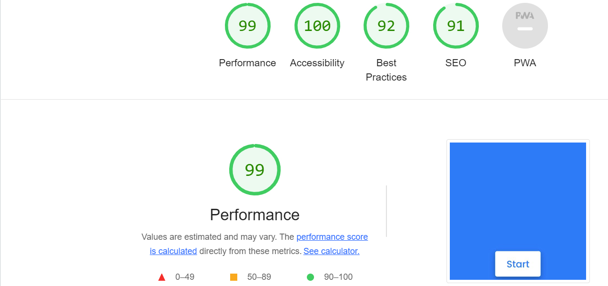

# Quiz App
This is a quiz that users can use to test their general knowledge on some well known topics. There are 5 questions in the quiz that are labelled numerically and should be answered one after the other, starting on question 1. The quiz is also responsive so it is a desktop and mobile friendly.

# Start Page:

# Instructions Page:
This page indicate the rules of the quiz.
The score will increase by one if an answer is correct otherwise will remain the same. 
When the user is ready to start the quiz they should press the 'Start' button.

# Questions:

# Result:

# Deployment

- The site was deployed to GitHub pages. The steps to deploy are as follows: 
  - In the GitHub repository, navigate to the Settings tab 
  - From the source section drop-down menu, select the Master Branch
  - Once the master branch has been selected, the page will be automatically refreshed with a detailed ribbon display to indicate the successful deployment. 

# Technology used 

- HTML5
The project uses HyperText Markup Language.

- CSS3
The project uses Cascading Style Sheets.

- JavaScript
The project uses JavaScript.

# Testing
Google Developer Tools 
 For every step along the project developement i have inspect and edited the style using Google developer tools. I also checked the accessibility of the page using Lighthouse.
 

 # Responsive Tools
I used responsivedesignchecker.com to make sure that all my pages are responsive to all devices.

### W3C Validator Tools

# HTML and CSS Validador:
I used W3C Markup to check for any errors within the HTML pages.

 The live link can be found here - https://afiay.github.io/Quiz-App/
